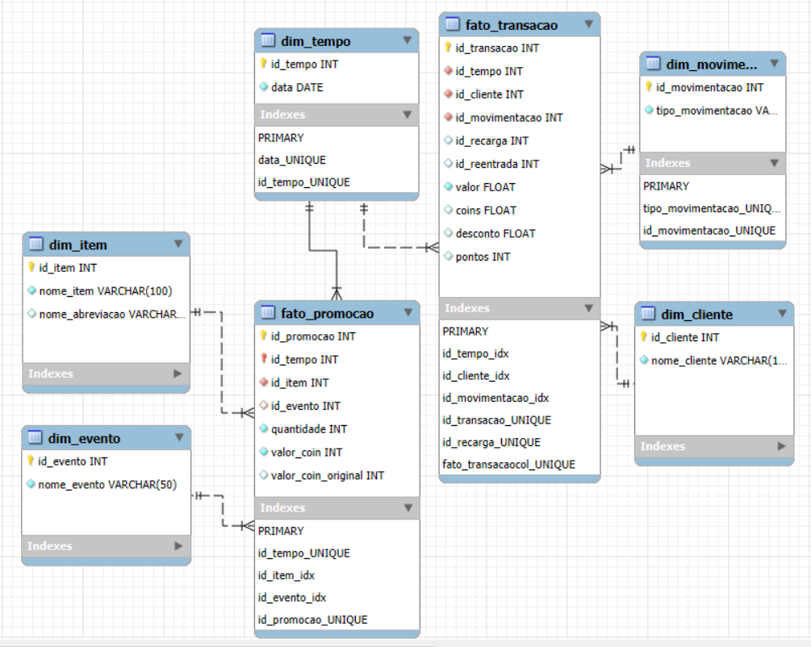
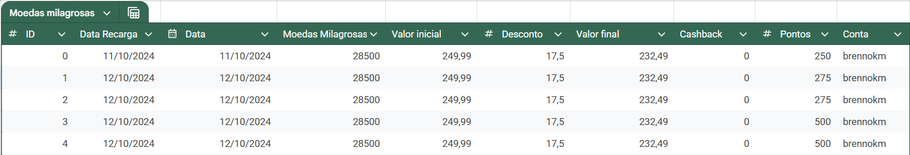
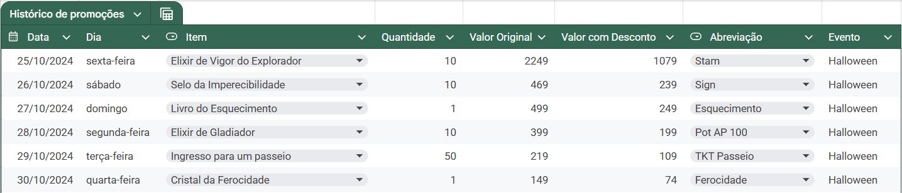
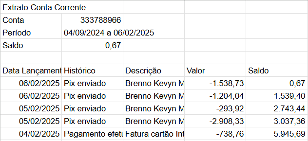
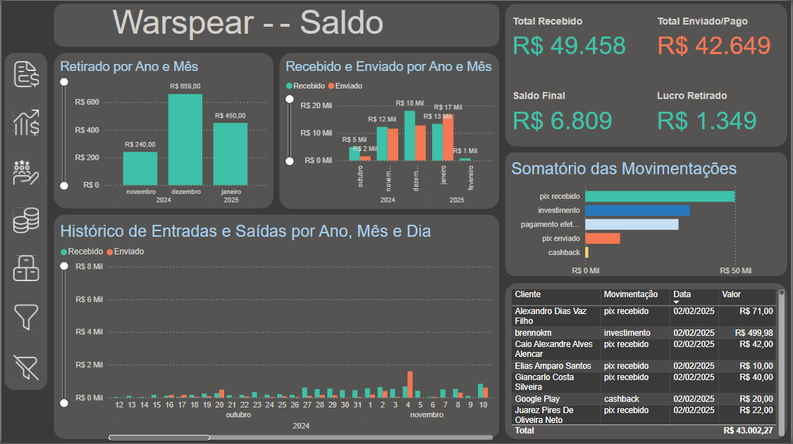
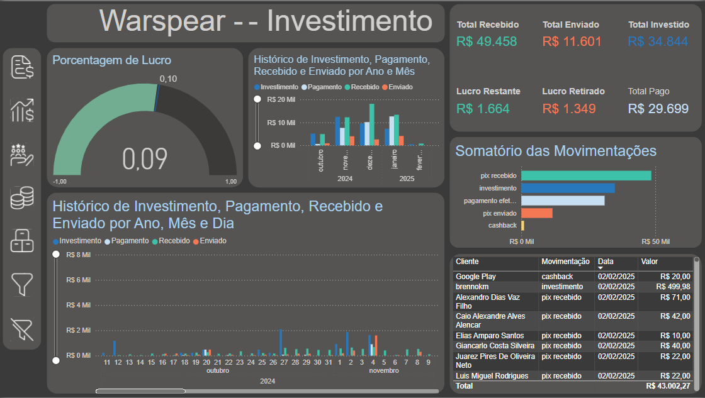
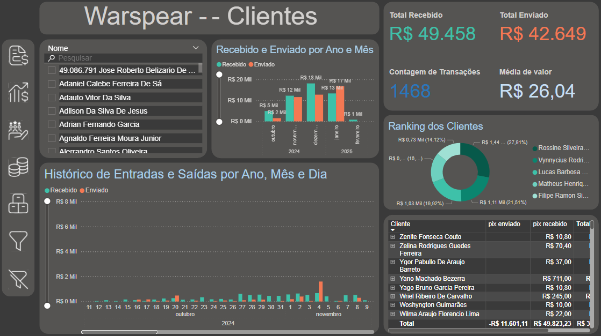
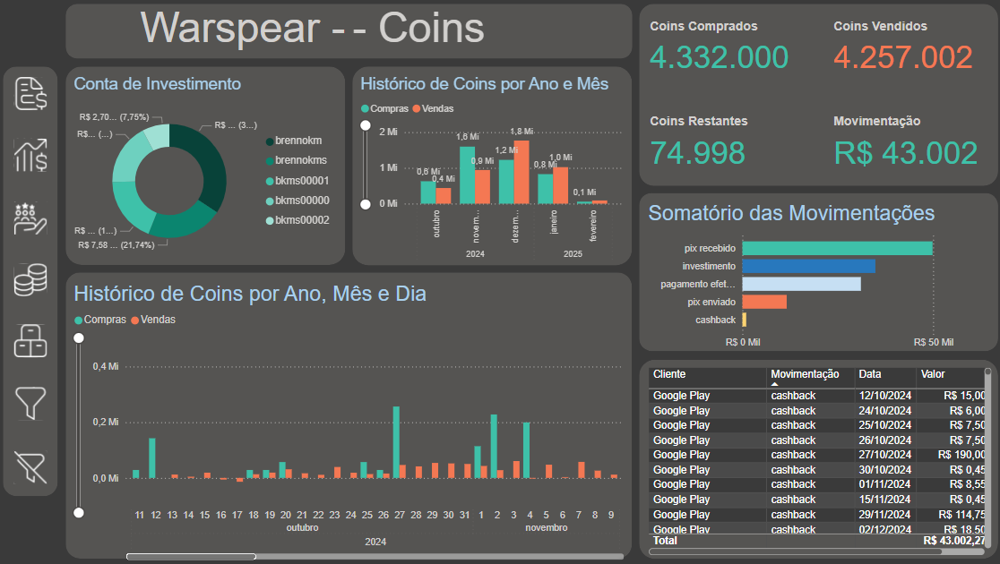
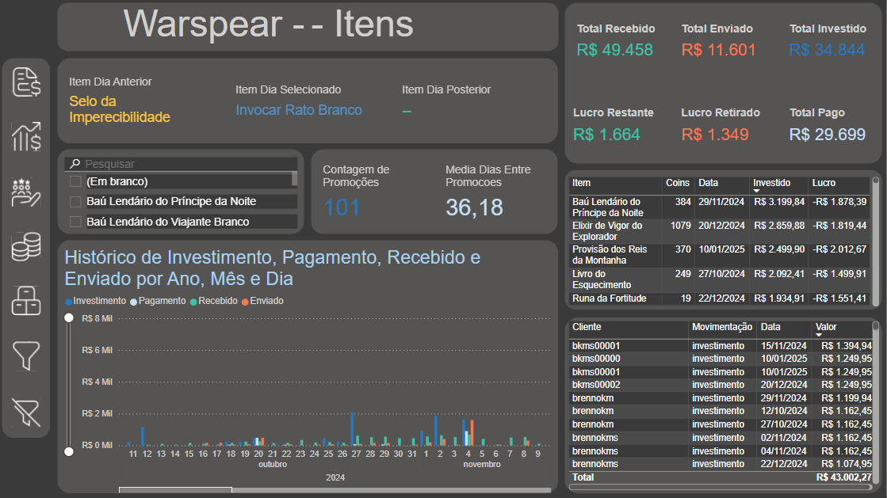

# WS-DashBoard

Este projeto é um painel de controle para gerenciar e visualizar transações financeiras e promoções ao longo do tempo em um jogo online.

## Estrutura do Projeto

- **csvs/**: Contém arquivos CSV com dados de transações e promoções.
- **etl/**: Scripts ETL (Extract, Transform, Load) para importar dados dos arquivos CSV para o banco de dados.
- **icons/**: Ícones utilizados no projeto.
- **sql/**: Scripts SQL para criar, manipular e consultar tabelas no banco de dados.
- **ws_powerbi.pbix**: Arquivo do Power BI para visualização dos dados.

## Fontes de Dados

Os dados utilizados no dashboard foram extraídos de arquivos CSV contendo informações sobre:

- Transações financeiras
- Promoções de itens no jogo
- Compras de moedas milagrosas

## Modelagem

Devido a necessidade de consultas e filtros diversificados foi usado a modelagem estrela no banco de dados.

Modelei duas tabelas fato e algumas dimensões, tornando possível que futuramente novas camadas possam ser adicionadas, como por exemplo o horário das transações para resultar em consultas ainda mais precisas.

## Extração

O começo do projeto foi aqui, na extração dos dados, todos eles, com exceção dos extratos bancários são preenchidos manualmente. Ou seja, eles são mais fáceis de trabalhar pois foram feitos de forma pensada e estruturada para o projeto.

### Exemplos dos dados usados

## Transformação

A transformação dos dados ficou voltada principalmente na parte dinâmica deles, os extratos. Cada instituição bancária usa um padrão diferente para exportação dos dados, alguns com mais colunas, alguns mais bagunçados e etc.
Optei por perder algumas camadas para que fosse possivel padronizar diferentes instituições, o modelo atual exige apenas data, valor, tipo de transação e o indivíduo. Deixando de lado outras informações importantes como documentos, horário e banco emissor da transação, essa perca foi necessária pois é uma parte do projeto estava nas mãos da padronização de cada banco, a maioria deles não exportam essas informações tão relevantes.

## Carregamento

Python foi a linguagem utilizada, tanto carregamento quanto as transformações dos dados foram feitos em um único script para cada tipo de dados, que efetua as transformações e logo em seguida são inseridas no banco de dados.

## Dashboard

Com os dados já dentro do banco de dados, era hora de finalmente fazer consultas. Algumas consultas simples foram pensadas, mas serviram apenas de base para montar um dashboard usando Power BI.
Definitivamente essa foi a parte mais trabalhosa pois exigiu bastante tempo para alinhar todas transações em diferentes categorias para que o resultado final fosse condizente com a realidade.

### Visualizações do Dashboard

Aqui estão algumas visualizações do dashboard criado no Power BI:

### Visão Geral do Saldo

### Análise de Investimento

### Consulta de Clientes

### Compras de Moedas Milagrosas

### Histórico de Promoções

